# Convert CSV Files to JSON with Azure Functions

## Introduction
_Note: This lab is still under development_

[TBD]

### Prerequisites

- Visual Studio 2017
- [Azure Functions and WebJobs Tools Extension for Visual Studio](https://marketplace.visualstudio.com/items?itemName=VisualStudioWebandAzureTools.AzureFunctionsandWebJobsTools)
- Microsoft Azure account
- [Azure Storage Explorer](https://azure.microsoft.com/en-us/features/storage-explorer/)

## Exercises

This lab consists of the following exercises:

1. [Create an Azure Function App](#Exercise1)
2. [Create a Blob Trigger Function](#Exercise2)
3. [Create a Blob Container with Azure Storage Explorer](#Exercise3)
4. [Build Function](#Exercise4)
5. [Run and Test Function Locally](#Exercise5)
6. [Deploy Function App to Azure](#Exercise6)
7. [Create Storage Account](#Exercise7)
8. [Configure Published Function App](#Exercise8)
9. [Run and Monitor Function](#Exercise9)

<a name="exercise1"></a>
## Create an Azure Function App in Visual Studio 

With the [Azure Functions and WebJobs Tools Extension for Visual Studio](https://marketplace.visualstudio.com/items?itemName=VisualStudioWebandAzureTools.AzureFunctionsandWebJobsTools), you can quickly get started with a function app in your local development environment.

1. Select File > New > Project to open the new Project dialog.
2. In the Project dialog select the C# Azure Functions template, which can be found under the Visual C# > Cloud tree node.

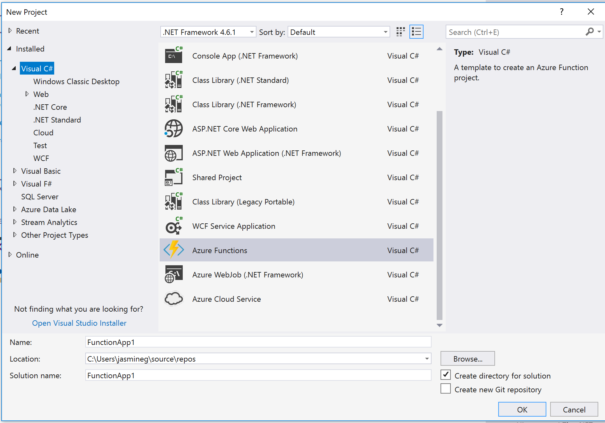

3. After typing the desired name and path, click OK.
4. In the template dialog, select the Empty template and click OK. [S]

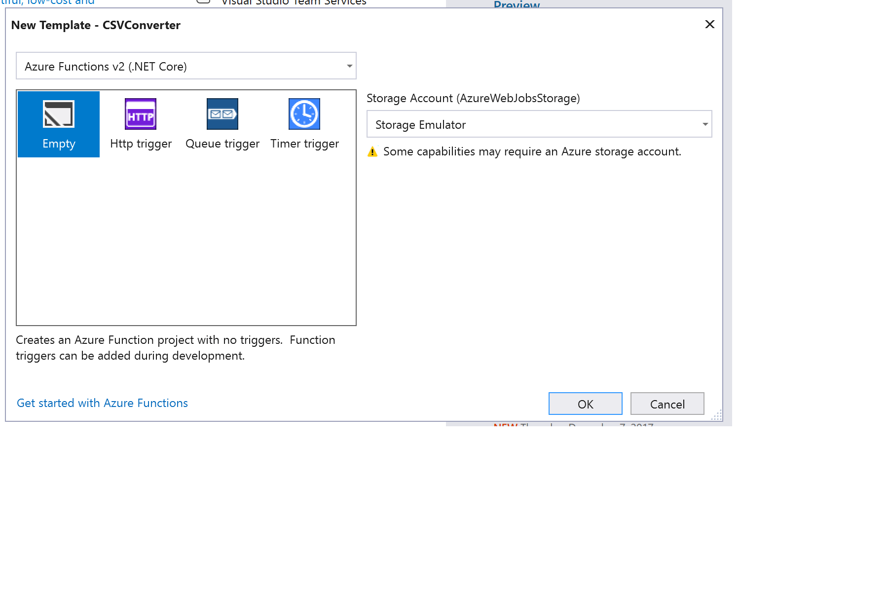

<a name="exercise2"></a>
## Create a Blob Trigger Function

Function Apps host the execution of Functions. We'll use the project that was created in the previous exercise to create a Function. The Blob trigger function template executes when a blob has been added to the blob container.

1. In Solution Explorer, found in View > Solution Explorer, right click on the project and select Add > New Azure Function...
2. In the New Azure Function dialog, select the Blob trigger template.

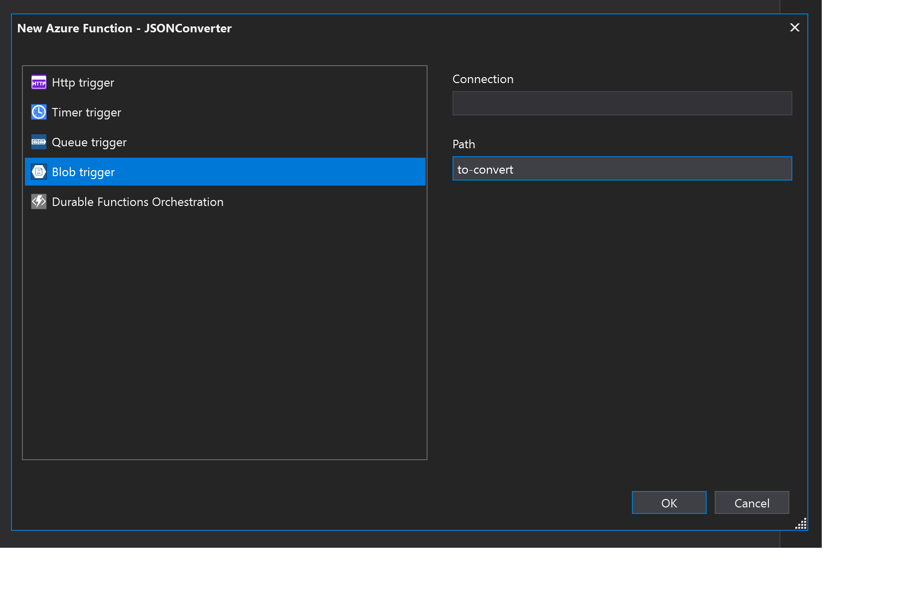

3. After typing the desired Blob container path, click OK. Save this path name for the next exercise.

<a name="exercise3"></a>
## Create a Blob Container with Azure Storage Explorer

The Azure Storage Explorer is a convenient way to access and maintain your storage accounts. The Azure Storage Emulator creates a local storage account that can be used for development and testing without needing to create or deploy a new storage account.

1. On the left hand side of the Storage Explorer, select the Local and Attached > Storage Accounts > (Development) > Blob Containers node.
2. If the Azure Storage Emulator is not installed, an infobar prompt will appear to install it. Select *Download the latest version* to download and install the Emulator.

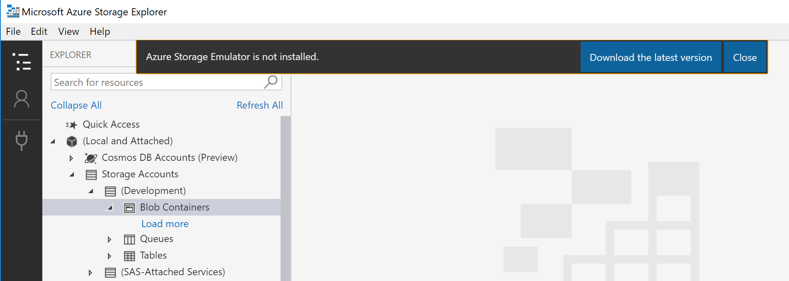

3. Right Click on Blob Containers and select Create Blob Container.

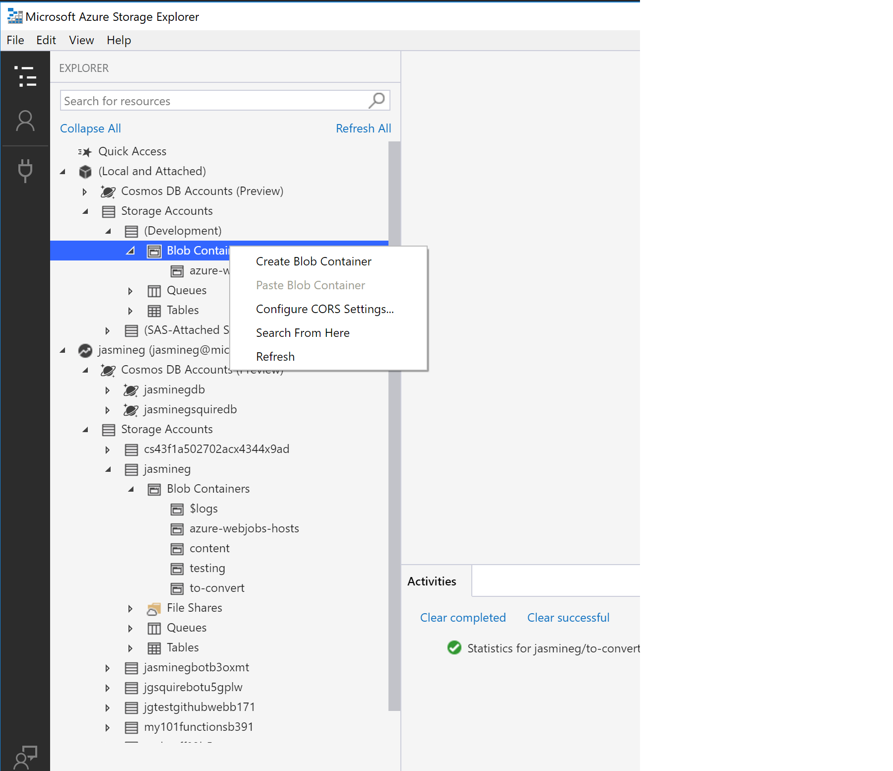

4. In the container name prompt, set the name as the desired path from the previous exercise.
5. Select Add Account to connect to your storage accounts on Azure. 

<a name="exercise4"></a>
## Build Function

The local development environment is now ready to work with the function. The Azure Functions Extension allows local execution and debugging of Functions in Visual Studio. The provided code has two methods: `Run` and `Convert`.

- `Run` starts the execution of the function by logging file metadata, confirming that it's a csv before calling the `Convert` method to parse the file, and finally printing its contents to the console as JSON.

- `Convert` parses the CSV file with the [CSVHelper](https://joshclose.github.io/CsvHelper/) library into a collection, which is then converted to JSON with [JSON.NET](https://www.newtonsoft.com/json).

1. From Solution Explorer, open the `local.settings.json` file and confirm that the following settings exists. Add this setting if it is missing. These settings will enable the use of the development storage account with the Storage Emulator.

```javascript
{
    "IsEncrypted": false,
    "Values": {
        "AzureWebJobsStorage": "UseDevelopmentStorage=true",
        "AzureWebJobsDashboard": "UseDevelopmentStorage=true"
    }
}
```

1. In the same file, add a Connection value with a Connection name of your choice:
```javascript
{
    "IsEncrypted": false,
    "Values": {
        "AzureWebJobsStorage": "UseDevelopmentStorage=true",
        "AzureWebJobsDashboard": "UseDevelopmentStorage=true",
        "Connection" : "CSVStorage"
    }
}
```

1. From Solution Explorer, open the `[YourFunctionName].cs` file.
1. Add the following libraries to the file with the following `using` statements:

```csharp
using Microsoft.Azure.WebJobs;
using Microsoft.Azure.WebJobs.Host;
using Newtonsoft.Json;
using System.IO;
using System.Linq;
using CsvHelper;
```

4. Replace the `Run` method with the following

```csharp
public static void Run([BlobTrigger("to-convert/{name}", Connection = "AzureWebJobsStorage")]Stream myBlob, string name, TraceWriter log)
{
    log.Info($"C# Blob trigger function Processed blob\n Name:{name} \n Size: {myBlob.Length} Bytes");

    //Only convert CSV files
    if (name.Contains(".csv"))
    {
        var json = Convert(myBlob);
        log.Info(json);
    }
    else
    {
        log.Info("Not a CSV");
    }
}
```

5. Add the following `Convert` method below `Run`:

```csharp
public static string Convert(Stream blob)
{
    var sReader = new StreamReader(blob);
    var csv = new CsvReader(sReader);

    csv.Read();
    csv.ReadHeader();

    var csvRecords = csv.GetRecords<object>().ToList();

    return JsonConvert.SerializeObject(csvRecords);
}

```

<a name="exercise5"></a>
## Run and Test Function Locally

The code for the function is now complete, and can be run and debugged locally in Visual Studio. The function will run when a file is dropped into the `to-convert` blob container, but will only print a JSON version of a file with a .csv extension. During debugging, a console window will appear, containing information on the App and Functions, and text from `log.Info` method calls.

1. Press F5.
1. Drag and drop csv file into `to-convert` blob container from exercise 4.

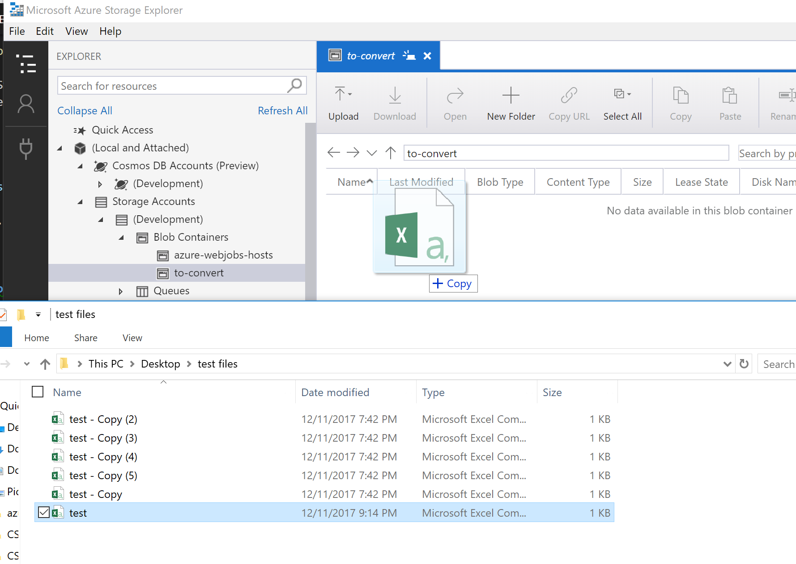

1. Check the console window, it should look similar to this:


<a name="exercise6"></a>
## Deploy Function App to Azure

1. Select Build > Publish 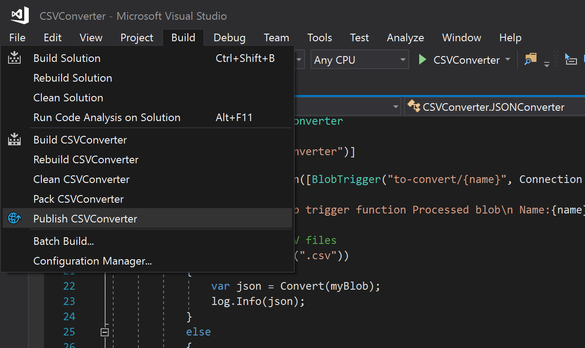
1. Select Azure Function App and click *Publish* 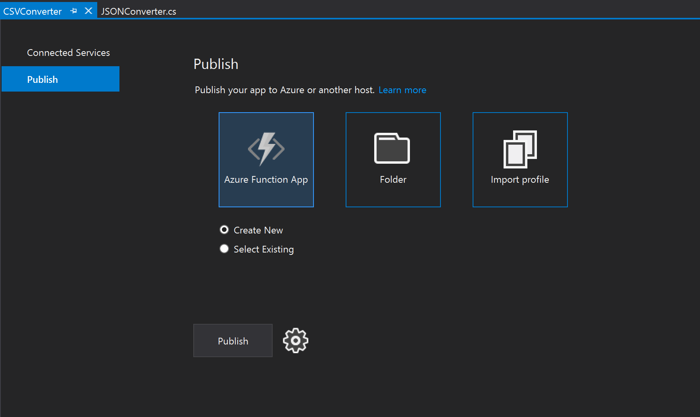
1. Enter a unique App Name. 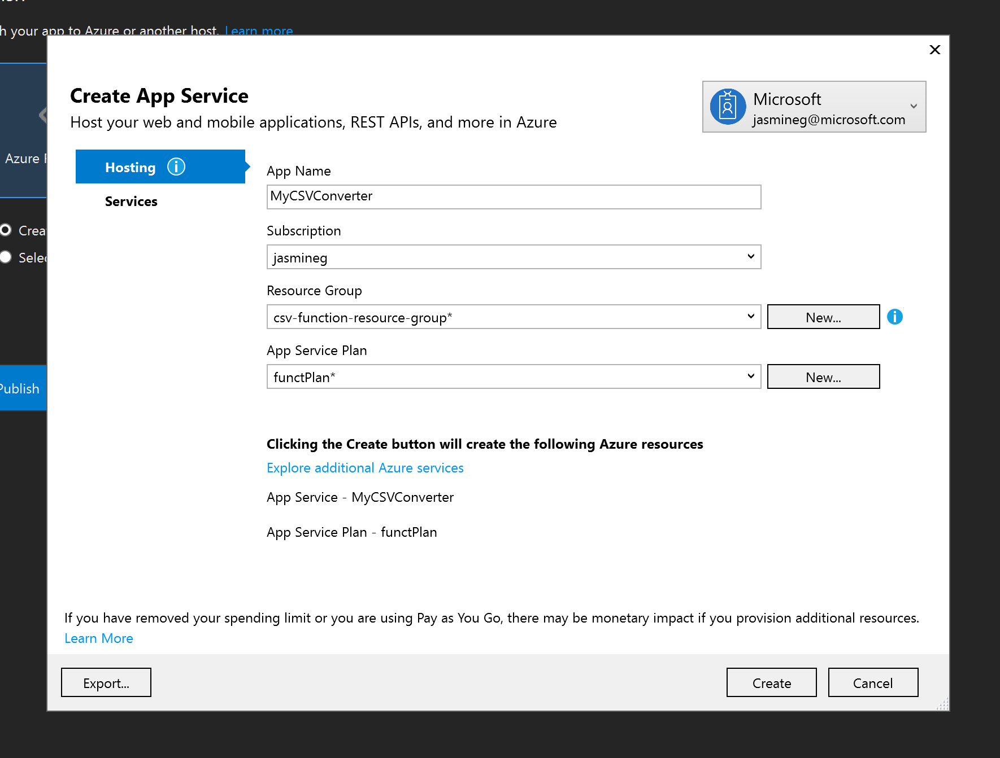
1. Select a subscription.
1. Select existing or create a new resource group with desired name.
1. Select existing or create a new app service plan with desired name, location, and size. 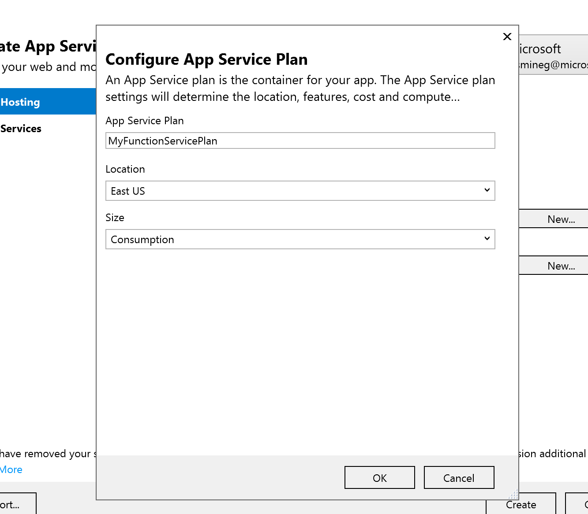
1. Click *Create*.

<a name="exercise7"></a>
## Create Storage Account

The Function is now published and visible in the Azure portal. In order for it to run as it did locally, it needs a storage account to set the Blob Trigger.

1. Select *Create a Resource*, then search for and select *Storage Account*. 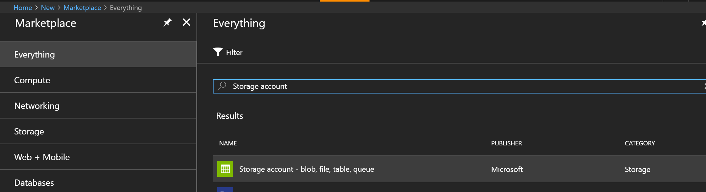
2. Enter a unique Name.
3. Choose an Azure subscription.
4. Create a new or existing Resource group.
5. Select a preferred Location.
1. Check *Pin to Dashboard*.
1. Click *Create*. 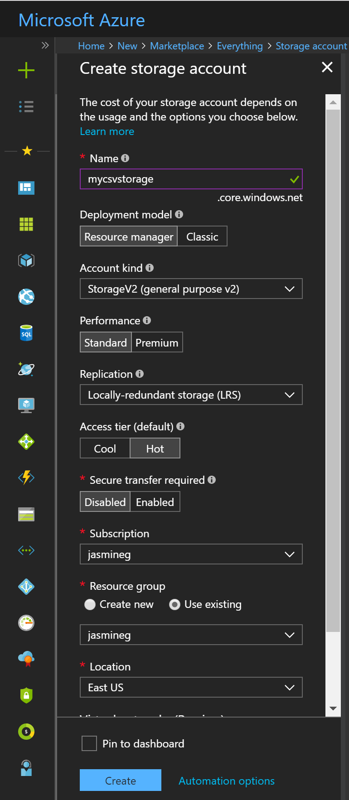
1. From the portal dashboard, locate and click on the new storage account to open the *Overview*.
1. In the menu to the left of the overview, navigate to *Access Keys*.
1. Copy the connection string. 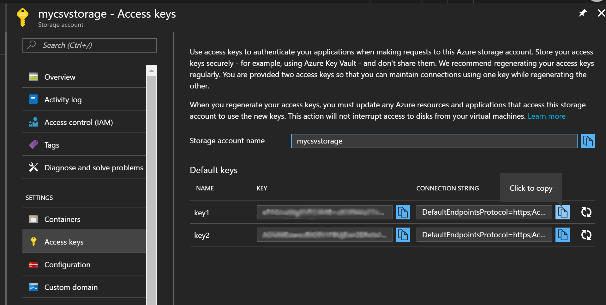
1. In the Storage Explorer, click *Refresh All* at the top and locate the new storage account. 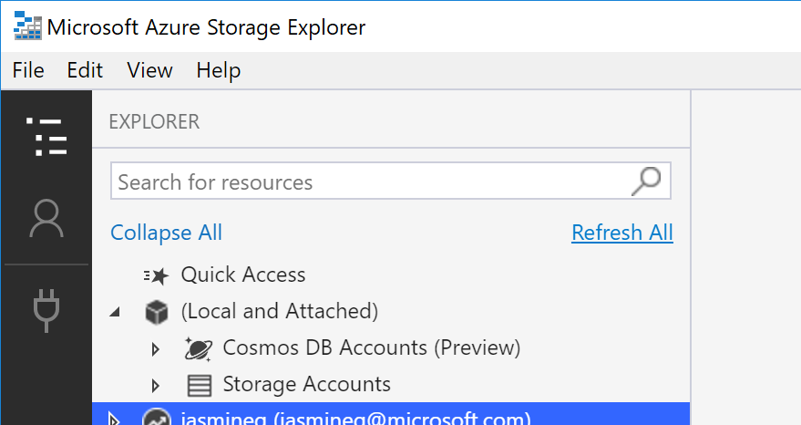
1. Expand the storage account, and select the *Blob Container* node.
1. Right click on the *Blob Container* node, and click *Create Blob Container* 
1. Enter container name as `to-convert`.

<a name="exercise8"></a>
## Configure Published Function App

1. In the portal, navigate to published function. Search for the App name to find it. 
1. In the function, navigate to application settings. 
1. Click *Add new setting*.
1. Set the name of the setting to the name of the Connection from Exercise 4, and paste the connection string as its value.
1. Click *Save*.

<a name="exercise9"></a>
## Run and Monitor Function

The function is now completely configured and can be tested and monitored in the Azure portal.

1. Drag and drop a CSV file into the new `to-convert` container made in Exercise 7.
1. In the portal, navigate to the published Function App.
2. Expand the Function App, locate the CSV converter Function, and click *Monitor*. 
3. Wait for log to appear. Use *Refresh* if necessary.

## Next Steps
